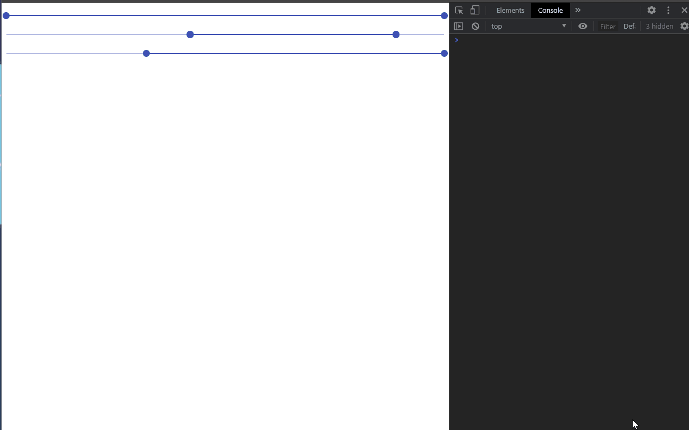

# react-slider-prototype

Check the comments in app.jsx my dude

Here is a gif of it working:

<p align='center'>
  
</p>

To test the code on your end follow these after cloning:

  1. Clone the repo

  1. Install Dependencies

      ```shell
      npm install
      ```
 1. Run the dev server

      ```shell
        npm run dev
      ```
